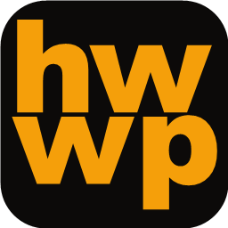

<p align="center">
  
</p>

<h1 align="center">HWWP</h1>

<p align="center">웹에서 바로 사용하는 HWP 워드프로세서</p>

<p align="center">
  <a href="https://hwwp.kr"><strong>hwwp.kr</strong></a> ·
  <a href="README_EN.md">English</a>
</p>

---

HWWP는 별도의 프로그램 설치 없이 웹 브라우저에서 HWP 문서를 열고 편집할 수 있는 웹 기반
워드프로세서입니다.

오픈소스 HWP 에디터 [rhwp](https://github.com/edwardkim/rhwp)를 기반으로 버그를 수정하고
사용자 경험을 개선했으며, Google Drive를 연동한 클라우드 작업 환경과 글쓰기에 집중할 수 있는
별도의 집필 모드를 추가했습니다.

서비스: **https://hwwp.kr**

## 주요 기능

### HWP 문서 편집

HWP 문서를 웹 브라우저에서 열고 편집할 수 있습니다.

기존 rhwp의 문서 편집 기능을 기반으로, 실제 글쓰기와 문서 작업에서 불편했던 부분을 수정하고
UI와 UX를 개선했습니다.

### Google Drive 연동

Google Drive와 연동하여 문서를 클라우드에서 관리하고 작업할 수 있습니다.

한 대의 컴퓨터에 종속되지 않고 여러 환경에서 이어서 글을 쓰는 것을 목표로 합니다.

### 집중 집필 모드

HWWP에는 문서 편집기의 여러 UI를 잠시 내려놓고 글쓰기에만 집중할 수 있는 별도의 집필 모드가
있습니다.

이 기능은 제가 이전에 만들었던 Writer's Homeground의 글쓰기 경험을 HWWP에 옮겨온 것입니다.
개발 과정에서는 이 기능을 '배명훈 모드'라고 부르고 있습니다. Writer's Homeground와 이 기능은
배명훈 작가의 소설 「홈, 어웨이」에서 영감을 받았습니다.

> '배명훈 모드'라는 명칭은 현재 개발 과정에서 사용하고 있는 이름이며, 정식 명칭으로 사용하는
> 것에 대해서는 작가님께 허락을 구할 예정입니다.

## 프로젝트의 시작

HWWP의 시작은 HWP 에디터가 아니었습니다.

2026년 초, 저는 [Writer's Homeground](https://writerhomeground.lovable.app/)라는 작은 웹
애플리케이션을 만들었습니다.

배명훈 작가의 소설집 《미래과거시제》에 수록된 「홈, 어웨이」에는 슬럼프에 빠진 작가가 글을 계속
쓸 수 있도록 도와주는 워드프로세서가 등장합니다. 작가가 글을 쓰면 프로그램이 반응하고
환호합니다. 그 아이디어가 마음에 들어, 실제로 제가 글을 쓸 때 사용할 수 있는 도구를 만들어
보았습니다.

Writer's Homeground는 글쓰기에 집중하고, 글을 쓰는 행위 자체에 작은 피드백을 제공하는 간단한
웹 애플리케이션이었습니다. 작성한 글은 Google Drive에 txt 파일로 저장했습니다.

개인적으로 이 도구를 상당히 오래 사용했고 실제 집필에도 많은 도움을 받았습니다. 하지만
어디까지나 프로토타입에 가까웠습니다.

## Writer's Homeground에서 HWWP로

그러던 중 오픈소스 HWP 에디터인 rhwp를 알게 되었습니다. rhwp는 HWP 문서를 웹 환경에서 읽고
편집할 수 있도록 만들어진 오픈소스 프로젝트입니다. 무엇보다 MIT 라이선스로 공개되어 있었기
때문에 그 위에서 새로운 시도를 해볼 수 있었습니다.

HWWP는 rhwp를 기반으로 다음과 같은 작업을 진행하면서 시작되었습니다.

- 실제 사용 중 발견한 버그 수정
- 문서 편집 UI와 UX 개선
- 일반적인 워드프로세서로 사용할 수 있도록 기능과 작업 흐름 보완
- Google Drive 연동
- 클라우드 기반 문서 작업 환경 구축
- Writer's Homeground의 아이디어를 발전시킨 집중 집필 모드 추가

결과적으로 Writer's Homeground에서 실험했던 '사람이 계속 글을 쓰게 만드는 작업 환경'을 실제
HWP 워드프로세서 안으로 옮기게 되었습니다.

## 왜 HWWP인가

HWP는 한국에서 여전히 매우 널리 사용되는 문서 형식이지만, HWP 파일을 편집하기 위해서는 특정
운영체제나 소프트웨어 환경에 의존해야 하는 경우가 많습니다.

HWWP는 가능한 한 단순한 방법을 지향합니다. 브라우저를 열고 hwwp.kr에 접속하면 바로 문서를 열고
글을 쓸 수 있는 환경을 만드는 것이 목표입니다.

동시에 HWWP는 단순히 HWP 파일을 열 수 있는 도구에 머무르지 않고, 실제로 오랜 시간 글을 쓰는
사람이 편안하게 사용할 수 있는 워드프로세서를 지향합니다.

## 문서는 어디로 가나

HWWP에는 서버가 없습니다. 문서를 여는 것도 고치는 것도 브라우저 안에서 일어나고, 저장은
사용자의 컴퓨터나 사용자 본인의 Google Drive로 갑니다. **문서 내용이 제작자에게 전달되는
경로는 없습니다.**

Drive 권한은 `drive.file` 하나만 요청합니다. 이 권한이 닿는 범위는 **HWWP가 만든 파일과,
사용자가 파일 선택 창에서 직접 고른 파일**입니다. 그 밖의 드라이브 파일에는 닿지 못하며,
HWWP가 드라이브를 둘러볼 수 없습니다.

워드프로세서이므로 사용자가 고르기만 하면 어떤 HWP 문서든 엽니다 — 다른 사람이 작성한
문서든, 드라이브에 올려둔 문서든 마찬가지입니다. 중요한 것은 **무엇을 열든 그 내용이
브라우저 밖으로 나가지 않는다**는 점입니다.

자세한 내용은 [개인정보처리방침](https://hwwp.kr/privacy)과
[서비스 약관](https://hwwp.kr/terms)에 있습니다.

## 오픈소스

HWWP는 MIT License로 공개합니다.

이 프로젝트를 만들 수 있었던 가장 중요한 이유 중 하나는 rhwp가 오픈소스로 공개되어 있었기
때문입니다. 다른 사람이 공개한 코드의 도움을 받아 제가 필요했던 도구를 만들 수 있었던 만큼,
HWWP에서 수정하고 추가한 작업 역시 다시 공개하는 것이 자연스럽다고 생각했습니다.

HWWP의 코드를 이용하여 새로운 프로젝트를 만들거나 수정하고 개선하는 것을 환영합니다. 버그
수정이나 기능 개선에 대한 Issue와 Pull Request도 환영합니다.

혼자 만들고 있어 답이 느릴 수 있습니다. 버그를 알려주실 때는 어떤 문서에서 무엇을 하다가
그랬는지 적어 주시면 좋습니다. HWP는 예외 사례가 많은 형식이라, 재현되는 문서 하나가 설명 열
줄보다 낫습니다.

**문서 엔진 자체의 문제**(파싱·렌더링·저장)라면 [rhwp](https://github.com/edwardkim/rhwp)에
알리시는 편이 더 많은 사람에게 도움이 됩니다.

### 보안 검사 도구가 잡을 수 있는 것

- **Google API 키와 클라이언트 ID** — 브라우저 번들에 실리는 값이라 공개가 전제입니다. 실제
  방어는 Google 콘솔의 사용처 제한이며, 사정은
  [`drive-config.ts`](rhwp-studio/src/storage/drive-config.ts)에 적었습니다. 클라이언트 보안
  비밀번호는 저장소에 없습니다.
- **`web/certs/localhost-*.pem`** — rhwp 초기 커밋에 있던 자체 서명 `CN=localhost` 개발
  인증서입니다. 이미 삭제되어 현재 트리에는 없으며, `localhost` 외에는 쓸 수 없는 키입니다.

## 빌드

Rust 툴체인과 Node가 필요합니다.

```bash
wasm-pack build --target web --out-dir pkg
```

```bash
cd rhwp-studio && npm install && npm run dev
```

WASM 산출물(`pkg/`)은 저장소에 커밋해 둡니다. 배포 환경에 Rust 툴체인이 없기 때문입니다.
엔진을 새로 빌드했다면 `pkg/.gitignore`를 비운 상태로 되돌리고 `pkg/`를 함께 커밋해야 합니다.

## Credits

### rhwp

HWWP는 오픈소스 프로젝트 rhwp를 기반으로 만들어졌습니다.

- Original project: https://github.com/edwardkim/rhwp
- License: MIT License

HWP 문서를 웹에서 다룰 수 있는 기반을 공개해주신 rhwp 개발자와 기여자분들께 감사드립니다.

### Writer's Homeground

HWWP의 집중 집필 기능은 이전 프로젝트인
[Writer's Homeground](https://writerhomeground.lovable.app/)에서 발전했습니다.

### 「홈, 어웨이」 / 배명훈

Writer's Homeground와 HWWP의 집중 집필 모드는 배명훈 작가의 《미래과거시제》 수록작
「홈, 어웨이」에 등장하는 워드프로세서에서 영감을 받았습니다. 소설 속 아이디어를 실제로 제가
사용할 수 있는 글쓰기 도구로 만들어보고 싶다는 생각에서 프로젝트가 시작되었습니다.

이 프로젝트는 배명훈 작가 또는 출판사와 공식적인 제휴 관계에 있는 프로젝트가 아니며, 작가의
공식적인 보증이나 참여를 의미하지 않습니다.

## 서비스 운영

HWWP는 정적 웹 애플리케이션으로 구성되어 있으며 Cloudflare의 정적 호스팅 환경을 통해
서비스하고 있습니다.

서비스 주소: **https://hwwp.kr**

가능한 한 설치 과정 없이 브라우저에서 바로 사용할 수 있는 문서 작업 환경을 지향합니다.

## 개발 방향

HWWP는 현재도 실제 집필과 문서 작업에 사용하면서 개선하고 있습니다. 특히 다음과 같은 부분을
중요하게 생각합니다.

- 안정적인 HWP 문서 편집
- 긴 글을 작성할 때 방해되지 않는 UI
- 빠르고 단순한 작업 흐름
- 클라우드를 통한 문서 관리
- 작가와 글을 많이 쓰는 사람을 위한 집중 집필 환경

HWWP를 사용하면서 발견한 문제나 개선 아이디어가 있다면 GitHub Issue를 통해 알려주세요.

## License

MIT License. 자세한 내용은 [LICENSE](LICENSE)를 참고하세요.

- HWWP (이 파생물의 변경분) — © 2026 류지원
- rhwp (문서 엔진 원본) — © 2025-2026 Edward Kim, MIT

함께 사용하는 글꼴·음원·아이콘·외부 서비스의 고지는
[THIRD_PARTY_LICENSES.md](THIRD_PARTY_LICENSES.md)에 모아 두었습니다.

HWWP는 (주)한글과컴퓨터와 아무런 관련이 없으며, HWP·HWPX 파일 형식 호환을 목적으로 하는 독립
프로젝트입니다.
